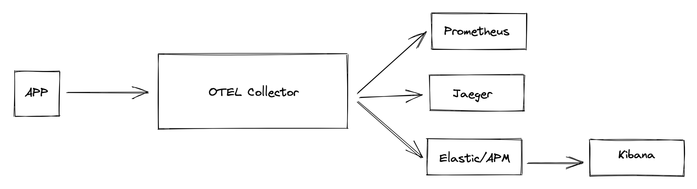

# Local OpenTelemetry

[](https://github.com/RichardLitt/standard-readme)

A demo project showing how to use [OpenTelemetry][1] locally.

## Table of Contents

- [About](#about)
- [Usage](#usage)

## About

This small project was the result of an internal study on how to use
OpenTelemetry's libraries to monitor our applications. It started as an study
on finding a substitute to our current, third party, monitoring service.

The directory structure is as follows:

```sh
$ tree -L 1
.
├── README.md
├── confs               # services configurations (used in docker-compose.yml)
├── docker-compose.yml  # services definitions
├── example             # sample expressjs app to generate traces/metrics
└── imgs
```

The project contains the following services:

| Service        | Address                            |
|:---------------|:-----------------------------------|
| Prometheus     | [localhost:9090](localhost:9090)   |
| Jaeger         | [localhost:16686](localhost:16686) |
| OTEL Collector | [localhost:4317](localhost:4317)   |
| ElasticSearch  | [localhost:9200](localhost:9200)   |
| Kibana         | [localhost:5601](localhost:5601)   |
| APM            | [localhost:8200](localhost:8200)   |

And here is the architectural diagram as a whole:



## Usage

To start all services, simply execute:

```
$ docker-compose up
```

You can monitor your application in the endpoints from the table in the
[about](#about) section. To generate some data, head to the sample app in the
[example](./example) directory.

[1]: https://opentelemetry.io/
