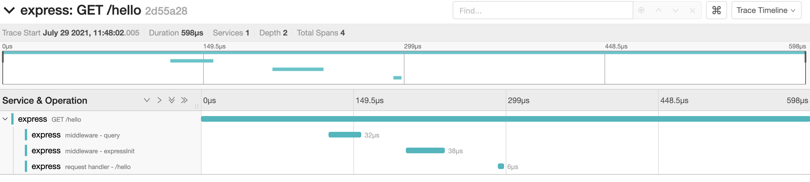

# Sample application

[](https://github.com/RichardLitt/standard-readme)

Sample application to generate traces/metrics for [OpenTelemetry][1]

## Table of Contents

- [About](#about)
- [Install](#install)
- [Usage](#usage)

## About

This app contains only two endpoints:

- `/nice`, returns `nice`
- `/hello`, returns `hello`

They don't do much as they were created for demonstration purposes.

## Install

You will need to install all node dependencies:

```
$ npm install
```

## Usage

To start the app just execute:

```sh
$ npm start
# or
$ node --require './tracing.js' app.js
```

You should use the `--require` flag as it will load the tracing part before
anything else. This is good because the libraries should start before the
application that is being monitored. The app will be available on
[localhost:8080](localhost:8080). If you want to generate some bogus traffic,
execute:

```
$ npm run traffic
```

It will perform requests on a loop to generate some data to bee seen on the
dashboards. The image below shows the APM dashboard view on Kibana.


And the following shows a single trace on Jaeger:



[1]: https://opentelemetry.io/
